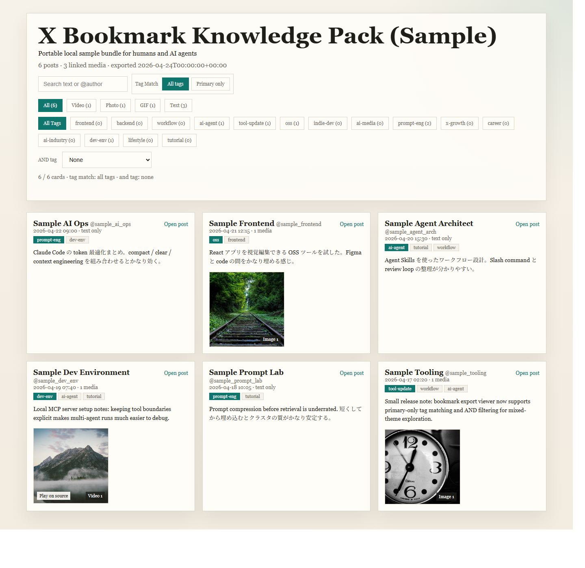

# x-bookmark-knowledge-pack

Turn X bookmarks into a **portable local knowledge pack** for both humans and AI agents.

This public repo is the distribution track for tooling incubated in the private `x-bookmark-gallery` environment.

## Core idea

This is **not** trying to be a generic bookmark SaaS.
It is trying to make exported X bookmarks:

- local-first
- portable
- human-browsable
- AI-readable
- static and archive-friendly

Think of it as:

**a knowledge-pack generator / viewer for X bookmarks**

not:

**a cloud bookmark manager**



---
## Who this is for

Good fit for:

- people who want a local-first way to reuse X bookmarks
- people who want the same bookmark corpus to work for both humans and AI agents
- people who already have an extracted bookmark DB / export process upstream

Not the best fit for:

- people looking for a polished cloud bookmark SaaS
- people looking for a zero-setup generic bookmarking product
- people who want the viewer itself to fully own upstream collection

---

## End-to-end idea

The intended flow is simple:

1. upstream extractor / bookmark DB produces JSON
2. `refresh_bundle.py` refreshes the stable bundle
3. `gallery.html` and companion JSON outputs are regenerated
4. a scheduler reruns the same command later

This is why the repo is positioned as a **knowledge-pack layer** on top of an extracted source, not as a full bookmark SaaS.

---

## Package shape

Minimum public bundle:

- `gallery.html`
- `bookmarks.json`
- `tags.json`
- `translations.json`
- `package-info.json`
- `README.md`

Optional later:

- `bookmarks.md`
- `bookmarks.jsonl`

`validation-report.json` is treated as **standard output for sanitized bundles**, but optional for sample/manual bundles.

---

## What already works

- local static gallery rendering
- text / author search
- media-type filtering
- tag filtering
- `Tag Match` toggle
- `AND tag` filtering
- sample pack generation
- private-style input -> public-safe bundle sanitizing
- validation report generation

---

## Fast start

### Build the sample pack

```powershell
python .\scripts\build_sample_pack.py
```

Output goes to `dist/sample-pack`.

### Render a gallery directly

```powershell
python .\scripts\render_gallery.py .\sample-data\bookmarks.json .\dist\custom\gallery.html --tags .\sample-data\tags.json
```

### Sanitize a broader private-style input

```powershell
python .\scripts\sanitize_import.py .\sample-data\private-input.sample.json .\dist\sanitized-sample --overwrite
```

### Refresh a stable bundle output

```powershell
python .\scripts\refresh_bundle.py .\sample-data\private-input.sample.json .\dist\live-bundle
```

The recommended upstream is an extracted bookmark DB / export JSON outside the viewer UI.

---

## Read next

- `docs/quick-reference.md`
- `docs/quickstart.md`
- `docs/sanitize-import-example.md`
- `docs/use-with-agents.md`
- `docs/public-safe-import-boundary.md`
- `docs/refresh-pipeline.md`
- `docs/scheduler-setup.md`
- `docs/recommended-upstream-input.md`
- `docs/who-its-for.md`
- `docs/end-to-end-example.md`

---

## Positioning

This project should try to win on:

- bookmark-to-knowledge-pack transformation
- local shareability
- AI-readable static artifacts
- simple human browsing over structured exports

Not on:

- cloud sync scale
- generic bookmark SaaS breadth
- “AI tagging” alone

---

## License

MIT
